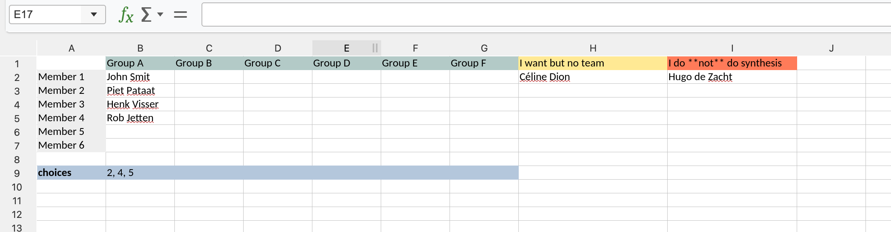

# Synthesis Project 👩‍🔧👨‍🔧


## Topics for 2026

```{note}
We decided **not** to run Project #1 with TNO because, after discussions, it was not certain that all three students would join the project, and one coul not be available for the full period.
This project was entirely led by TNO, with limited TU Delft involvement, so we could only run it if participation was fully confirmed because we are committing to an external partner.

Students whose project is no longer going ahead can speak to the two teams and the associated supervisors to see whether they can still be added; there is space.
```


| # | topic | tudelft staff | company | students |
|---|-------|---------------|---------|----------|
| 4 | European Point Cloud Data collection and display | [Daan vd Heide](https://3d.bk.tudelft.nl/dvdheide/) + [Maarten Pronk](https://www.evetion.nl/) + Gina | Rijkswaterstaat + Deltares| Ruben Vons, Artemi Kurski, Arda Baysal |
| 6 | Automatic tree reconstruction for CFD simulations - tree4cfd |Clara + [Themis Vargiemezis](https://3d.bk.tudelft.nl/tvargiemezis) | Haskoning |Evangelia Palli, Anna Scherrenburg, Henryk Gujda, Simon Deuten |
| 1 | ~~Munition magazine complex (MMC) of the future~~ | ~~Edward Verbree~~ | ~~Koen Winters, TNO-Defensie~~ ||
| 2 | ~~Topotijdreis & Histovec~~ | ~~Edward Verbree~~ | ~~Vincent van Altena, Kadaster~~||
| 3 | ~~Open map room~~ | ~~Martijn Meijers + Edward Verbree~~ | ~~Jules Schoonman, TUDelft library~~ ||
| 5 | ~~Inclusive Campus Map: Mapping Perceived Campus Safety~~ | ~~Bastiaan + Gina + [Ana Petrović](https://research.tudelft.nl/en/persons/a-petrovi%C4%87/)~~ | ~~TUDelft~~ ||
| 7 | ~~Colourful (and efficient!) buildings: Towards Building Renovation Passport~~ | ~~Giorgio + [Hiba Doi](https://3d.bk.tudelft.nl/hiba/)~~ | ~~Vitec Vabi~~ ||

[⬇️ All the slides](https://surfdrive.surf.nl/s/p4cDDpbtE96eQXW)

The voting sheet is available here: <https://surfdrive.surf.nl/s/MWCWGbzWEa3xqga>.


<!--## How to choose?

**Deadline to do this ==> Monday 11 May 2026 at 11:00 in the morning!**

OK, we would like to move fast and have all the groups and topics formed before [BIS opens (Monday 11 May2026 @ 17:00)](https://bis.bk.tudelft.nl/student), so that those who don't get their choice can take free electives instead.

So the idea is the following:

You form your own groups and write directly the names of the members (first name + family name) in this public spreadsheet: <https://surfdrive.surf.nl/s/MWCWGbzWEa3xqga>-->
<!--
Teams have minimum=4 and maximum=6

If there are students without teams, then we will see and bundle them together, so use the last column to indicate that you want to do GEOIT1501, but you don't have a team.
In the last row, indicate for your teams the projects you want to do, in order of preference. Put at least 1 (duh!) and max 5.

If you plan to *not* do the synthesis then please write it in the last column too.

It should look like this:

-->


<!--|    | projet | client(s) | supervisors(s) | students |
|----|--------|-----------|----------------|----------|
| 1  | Inclusive 3D Campus Map TU Delft | [TU Delft Diversity & Inclusion Office](https://www.tudelft.nl/en/about-tu-delft/strategy/diversity-inclusion/contacts-network) | Bastiaan van Loenen + [Gina Stavropoulou](https://3d.bk.tudelft.nl/gstavropoulou/) | Phuong Anh Ho, Lars van Blokland, Alexandre Bry, Daan Schlosser, Mingjie Teo |
| 2  | To dredge or not to dredge | [Van Oord](https://www.vanoord.com/) | Edward Verbree | Michel Beeren, Luc Jonker, Yair Roorda, Vincent Vanderheeren  |
| 3  | Spatial Understanding via Multimodal LLM | [Scanplan](https://www.scanplan.com) | [Liangliang Nan](https://3d.bk.tudelft.nl/liangliang) | Segher ter Braak, Mark van der Meer, Julia Pille, Neelabh Singh, Hongyu Ye |-->


```{toctree}
:maxdepth: 0
:hidden:

news
about
dates
deliverables/index
grading/index
templates/index
faq
```
